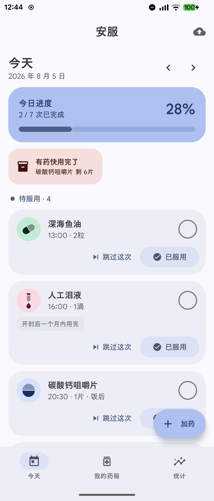
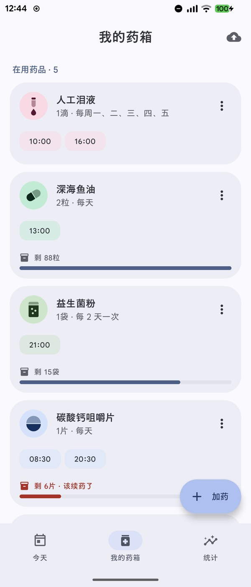
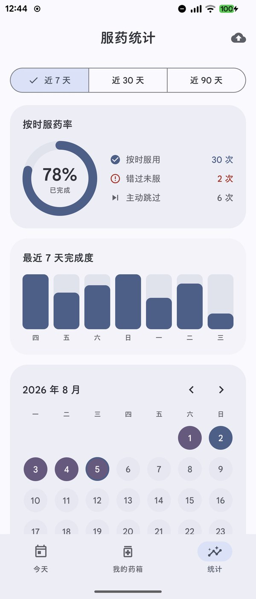
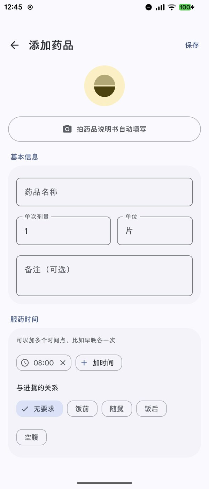
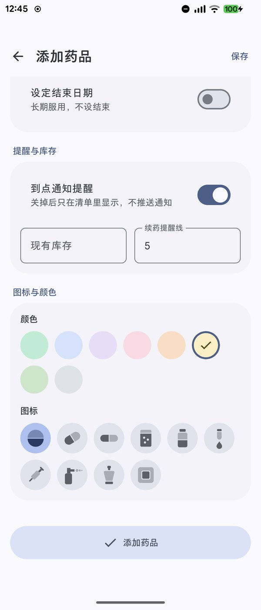
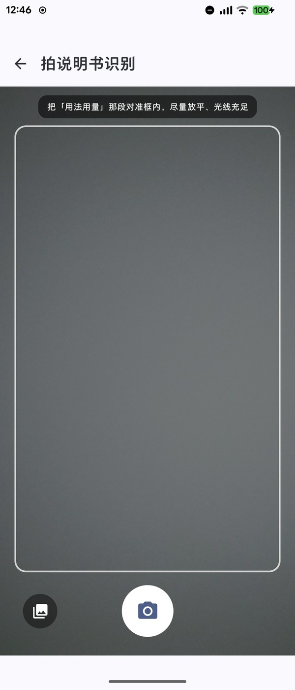
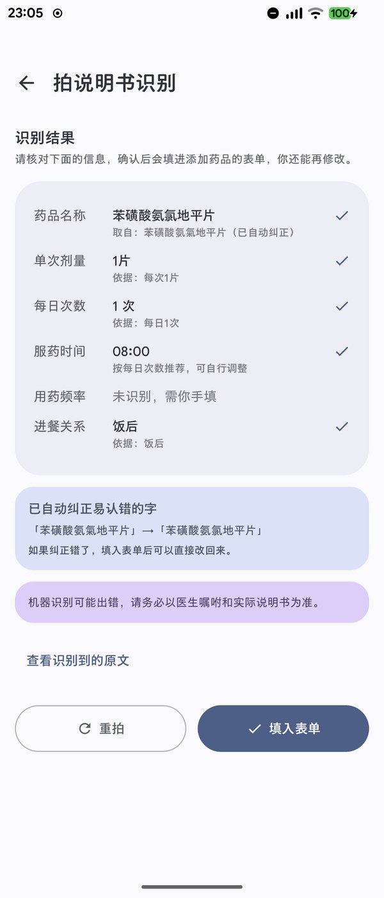

<div align="center">

# 安服

**Android 服药提醒应用 · 让你或家人不漏服、不错时**

数据只存在手机本地 · 不联网 · 不上传 · 无需注册

[](#系统要求)
[](https://kotlinlang.org)
[](https://developer.android.com/jetpack/compose)
[](LICENSE)

</div>

---

「安服」取「安心服药」之意。它只做一件事：**在该吃药的时候提醒你，并记下你吃没吃**。

<div align="center">

&nbsp;

&nbsp;

</div>

> 截图里的药品与记录均为演示数据。

---

## 为什么做这个

长期服药最常见的三件麻烦：**忘记吃**、**记不清吃过没有**、**药快用完了不知道**。

市面上的服药提醒应用大多要注册账号、要联网、带广告，而用药信息是相当敏感的健康数据。安服不联网、没有服务器、不申请任何网络权限——所有数据就在你手机的应用私有目录里。

## 功能

| | |
| --- | --- |
| **准点提醒** | 系统精确闹钟，通知栏直接带「已服用 / 稍后提醒 / 跳过」三个按钮，不用打开应用就能打卡。手机重启、改时间、换时区后自动重排。 |
| **今日清单** | 当天要吃的药按「已错过 / 待服用 / 已完成」分组，打过卡的显示实际服用时间。 |
| **复杂周期** | 每天 / 按周固定几天 / 隔 N 天 / 吃 X 天停 Y 天。可设疗程起止日期与饭前饭后。 |
| **库存管理** | 记录每种药剩多少，打卡自动扣减，低于设定值提醒续药。 |
| **依从率统计** | 圆环 + 7 天柱状图 + 月历三种视图，可切换近 7 / 30 / 90 天。复诊时给医生看比口头回忆可靠。 |
| **拍说明书自动填写** | 拍一张药品说明书，自动识别药名、剂量、每日次数、饭前饭后并预填表单。**完全离线**，照片不保存不上传。 |
| **备份与换机** | 导出为单个 JSON 文件。可指定云盘同步目录，换手机时导入即可恢复全部历史。 |
| **提醒可靠性体检** | 自动检查通知权限、精确闹钟权限、电池优化豁免，并按手机品牌给出对应设置提示。 |

<div align="center">

&nbsp;

&nbsp;

&nbsp;

</div>

## 下载安装

到 [Releases](../../releases) 页面下载 APK。

| 版本 | 大小 | 适用 |
| --- | --- | --- |
| `arm64-v8a` | 约 16 MB | **推荐**。2017 年之后的手机几乎都是这个架构 |
| `universal` | 约 45 MB | 不确定手机架构时的兜底版本，装上一定能跑 |

体积差异来自离线中文 OCR 模型——它每个 CPU 架构一份约 10 MB，而任何一台手机只会用到其中一份。

### 系统要求

Android 7.0（API 24）及以上。

### 首次使用请完成三项系统设置

应用首次启动会引导你打开这三项。**不设置的话，该吃药时可能收不到提醒**——手机的省电机制会冻结后台应用。

- 允许发送通知
- 允许精确闹钟
- 电池策略设为「无限制」／「不优化」

引导页会识别你的手机品牌给出对应提示（小米需开自启动、索尼需处理 STAMINA 模式等）。

## 隐私

- **无网络权限**。`AndroidManifest.xml` 里没有 `INTERNET`，应用在技术上无法联网。
- **文字识别在本地完成**。用 Google ML Kit 的中文识别模型，随安装包附带，不需要下载也不上传图片。拍下的照片识别完即丢弃。
- **备份文件由你掌控**。导出的是未加密的纯文本 JSON，存到哪、给谁看完全由你决定。应用不会自动上传到任何地方。
- 申请的权限只有三项：通知、精确闹钟、相机（仅在使用拍说明书功能时）。

## 使用说明

完整说明见 [《安服使用说明》PDF](docs/安服使用说明.pdf)，共 9 页，含界面截图、常见问题与免责说明。Releases 页面也附了这个文件。

## 自行构建

```bash
git clone https://github.com/jiantous/anfu-pill-reminder.git
cd anfu-pill-reminder

# 指向你的 Android SDK
echo "sdk.dir=/path/to/android/sdk" > local.properties

# debug 包，直接可用
./gradlew assembleDebug

# 跑单元测试
./gradlew testDebugUnitTest
```

Release 构建需要自己的签名密钥。在项目**外部**建一个目录放 `keystore.properties`：

```properties
storeFile=my-release.jks
storePassword=...
keyAlias=...
keyPassword=...
```

`storeFile` 支持绝对路径，也支持相对该文件所在目录。构建脚本按以下顺序查找配置：

1. 环境变量 `PILL_KEYSTORE_PROPS` 指向的完整路径
2. 仓库同级的 `../AndroidKeys/keystore.properties`
3. `~/AndroidKeys/keystore.properties`

找不到时会跳过 release 签名，debug 构建不受影响。

## 技术实现

Kotlin + Jetpack Compose + Material 3，单 Activity，无第三方 UI 库。

| | |
| --- | --- |
| 最低 / 目标 | API 24 / API 37 |
| 界面 | Compose + Material 3，支持动态取色（Material You）与深色模式，edge-to-edge |
| 提醒 | `AlarmManager.setExactAndAllowWhileIdle` + `RTC_WAKEUP`。一次性闹钟，触发后重排下一次；另有 6 小时周期的守护任务兜底，防止链条被系统中断后永久失效 |
| 通知 | 闹钟类音频属性（`USAGE_ALARM`）+ `CATEGORY_ALARM`，以便在系统免打扰下仍能响 |
| 数据 | kotlinx.serialization，单个 JSON 文件。写入用「临时文件 + 改名」防止写一半损坏；从广播接收器写入时同步落盘，避免进程被回收导致丢数据 |
| OCR | ML Kit 中文文字识别（bundled 模型）+ CameraX。自研说明书解析器，保守提取：拿不准的字段留空交给用户填 |
| 构建 | AGP 9 / Gradle 9，R8 混淆 + 资源压缩，按 ABI 拆分 APK |

### 目录结构

```
app/src/main/java/com/jian/pillreminder/
├── data/           数据模型、JSON 持久化、备份导入导出
├── domain/         纯逻辑：排程计算、说明书解析、药名纠错
├── notify/         闹钟排程、通知、广播接收、可靠性体检
└── ui/             Compose 界面
    ├── components/ 通用组件、按剂型分类的药品图标集
    ├── screens/    今日 / 药箱 / 统计 / 编辑 / 扫描 / 备份 / 引导
    └── theme/      配色与字体
```

### 测试

79 个单元测试 + 3 个设备测试，覆盖排程计算、说明书解析、药名纠错、备份合并、数据迁移。

```bash
./gradlew testDebugUnitTest        # 单元测试
./gradlew connectedAndroidTest     # 设备测试（会先卸载应用，注意数据）
```

## 已知限制

- 一台手机一份数据，没有多用户切换。给家人用需要在他们手机上单独装。
- 没有桌面小组件。
- 到点只提醒一次，没有「未处理就追问」的补提醒。
- 说明书识别对排版复杂或印刷模糊的说明书成功率有限，识别不出的字段会明确标注让你手填。

## 免责声明

安服是**辅助记录与提醒工具**，不是医疗器械，**不提供任何医疗建议**。

- 吃什么药、吃多少、吃多久，请完全遵照医生嘱咐和药品说明书。
- 拍说明书的识别结果由机器产生，可能出错，请逐项核对。
- 提醒依赖手机系统的闹钟与通知机制。若系统省电策略限制了本应用，或手机关机、静音、被强制停止，提醒可能延迟或不出现。**请勿将本应用作为唯一的用药保障手段。**
- 打卡记录由使用者手动确认，应用无法核实是否真的服药，统计数字不代表实际服药事实。

如果你正在服用需要严格按时的药物（抗凝药、免疫抑制剂、精神类药物等），请同时使用其它提醒方式作为备份，并与医生确认漏服后的处理方式。

## License

[MIT](LICENSE)
